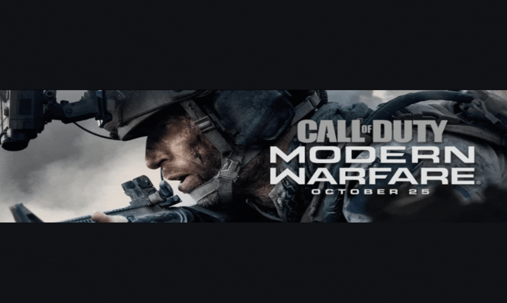
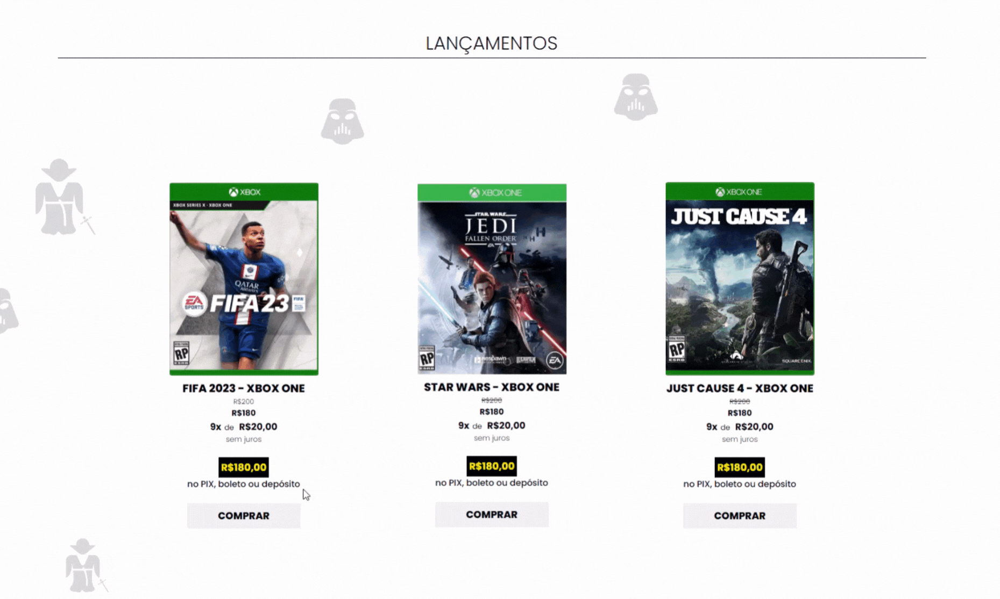
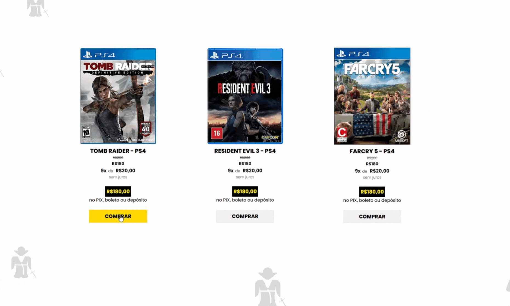
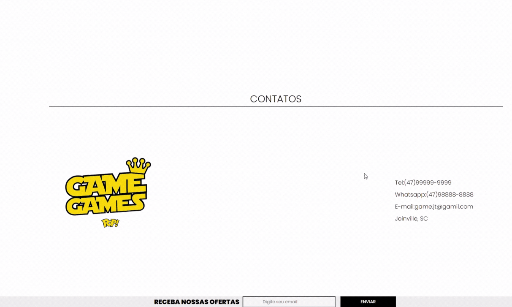

<h1 align="center">

Landing page Game

</h1>

## 📘 Sobre
<h1></h1>

O projeto **Landing Page Game** foi desenvolvido para praticar o modo Flexbox em uma página, criando estruturas de produtos com informações para compra.   
 
 
 
 

## 🔨 Ferramentas utilizadas

- HTML
- CSS

 
 
 

## Objetivo com o projeto:
<h1></h1>

Demonstrar e praticar em uma página, a montagem de uma estrutura em HTML, CSS usando o modo Flexbox para o desenvolvimento do menu, imagens e informações dos produtos, além de iserir vídeo no HTML.

 
 
 

## Aprendizado
<h1></h1>

Obtive uma evolução utilizando o Flexbox, isso me ajuda a facilitar a criação de estruras para imagens e textos. aprendi também a importar um vídeo no HTML e a configurar os ajustes para página. 

 
 
 
 

 
  
  
  
  
